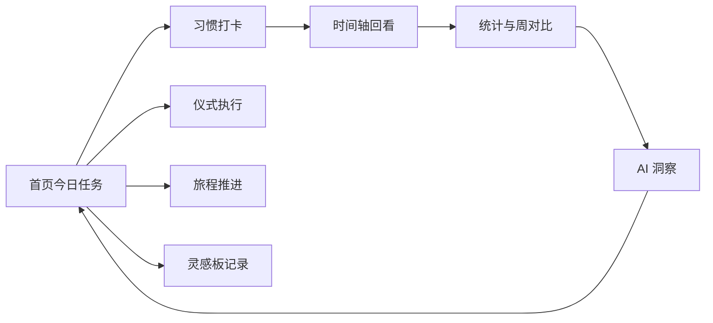

[中文](README.md) | [English](README.en.md)

# Day时序

[](https://github.com/najmahapih-jpg/Day-shixu/actions/workflows/ci.yml)


Day时序是一个面向个人成长记录的微信小程序，把习惯、仪式、旅程、灵感板、时间轴、统计和复盘放在同一套产品闭环里。这个仓库同时维护前端页面、微信云开发云函数、工程脚本、发布记录和交接文档。

当前 README 的定位是正式工程入口：第一次接手项目时，先用它确认项目现状、运行方式、质量门禁、发布边界和后续文档入口。

## 当前状态

- 当前小程序版本为 `v1.0.2`，版本号来自 `manifest.json`。
- 公开配置中只有 `dev` 环境可直接作为工程基线；`staging` / `prod` 需要本地 override 和微信后台资源。
- 标准本地交接门禁是 `npm.cmd run check:gate`，覆盖类型检查、Jest、预飞检查、仓库卫生和公开仓库安全检查。
- 微信小程序发布仍需要 HBuilderX 构建、微信开发者工具/后台验证和人工审核流程。

## 项目快照

| 项 | 当前事实 |
| --- | --- |
| 产品类型 | 个人成长类微信小程序 |
| 运行目标 | `mp-weixin` |
| 主包页面 | `pages/index`、`pages/timeline`、`pages/board`、`pages/profile` |
| 分包页面 | 习惯创建/详情、仪式编辑/执行、旅程列表/详情/完成页、统计详情、AI 洞察、归档、设置、onboarding |
| 前端栈 | `uni-app`、Vue 3 Composition API、Pinia、SCSS |
| 云端栈 | 微信云开发 / CloudBase、`wx-server-sdk`、TypeScript 云函数 |
| 发布记录 | `releases/history/<environment>/` 存放 release / rollback manifest |

## 产品闭环



## 核心功能

| 模块 | 能力 |
| --- | --- |
| 习惯 | 创建、编辑、归档、恢复、排序、打卡、取消打卡、连续天数、冻结日 |
| 首页 | 今日任务、进度卡、周对比、旅程入口、仪式入口、AI 洞察入口 |
| 时间轴 | 月历与时间线视图、历史打卡回看、日期切换、未来日期限制 |
| 灵感板 | 文本便签、清单便签、标签、置顶、布局位置、关联习惯、内容安全检查 |
| 仪式 | 计时执行、关联习惯、批量打卡、执行结果汇总 |
| 旅程 | 预设旅程、步骤推进、进度记录、完成页 |
| AI 洞察 | 基于习惯数据生成周对比、建议和 fallback 文案 |
| 统计 | 热力图、连续天数、周对比、习惯统计详情 |
| 用户与设置 | 静默登录、微信资料同步、减少动态效果、通知开关、默认周起始日 |
| 通知 | `notify` 云函数按提醒时间与用户设置发送订阅消息 |

## 架构总览

```text
Day时序/
├─ pages/                    # 页面层：tab 页和分包页
├─ components/               # UI 组件与页面区块
├─ composables/              # 页面交互、动效、数据流和可复用逻辑
├─ stores/                   # Pinia 状态层
├─ services/                 # 前端到云函数的调用边界
├─ cloudfunctions/           # 微信云函数源码、测试、mock、共享模块
├─ types/                    # 前后端共享类型
├─ utils/                    # 日期、环境、缓存、安全数据、展示计算等工具
├─ styles/                   # 全局样式、设计变量、动画、暗色模式
├─ scripts/                  # 工程检查、环境切换、云函数部署、发布脚本
├─ config/                   # 命名环境配置与本地 override 示例
├─ docs/                     # 工程说明、交接、发布、验收文档
└─ releases/                 # 结构化发布记录与模板
```

主要调用链：

```text
pages -> components / composables -> stores -> services -> cloudfunctions -> CloudBase database / openapi
```

维护原则：

- 页面负责用户流程和页面 owner 边界。
- 组件负责可复用展示和局部交互。
- `stores/` 负责状态聚合、缓存、防重复操作和页面间共享数据。
- `services/` 是前端调用云函数的唯一缓冲层，不建议页面直接散落 `wx.cloud.callFunction`。
- 云函数以 `OPENID` 隔离用户数据，并在 UGC 写入路径上做内容安全检查。
- `cloudfunctions/_shared/` 通过同步脚本进入各函数目录，不建议手工复制。

## 快速上手

### 前置条件

- Node.js `18.x`
- npm
- Windows PowerShell（仓库脚本以 PowerShell 为主）
- HBuilderX / uni-app 构建能力
- 微信开发者工具
- 需要部署云函数时，先完成 CloudBase CLI 登录：`npx tcb login`

### 按目标选择路径

| 目标 | 建议动作 |
| --- | --- |
| 只做代码级校验 | 安装依赖后运行 `npm.cmd run typecheck` 与 `npx.cmd jest --runInBand` |
| 做交接前完整门禁 | 运行 `npm.cmd run check:gate` |
| 调试微信小程序 | 先用 HBuilderX 构建 `mp-weixin`，再运行 `npm.cmd run prepare:wechat` |
| 部署云函数 | 先 `npx tcb login`，再使用 `cf:deploy:*` 脚本 |

最小本地校验：

```bash
npm install
npm.cmd run env:list
npm.cmd run typecheck
npx.cmd jest --runInBand
```

完整交接门禁：

```bash
npm.cmd run check:gate
```

### 本地微信小程序调试

1. 在 HBuilderX 中将项目构建为 `mp-weixin`，输出目录为 `unpackage/dist/dev/mp-weixin`。
2. 构建后运行：

   ```bash
   npm.cmd run prepare:wechat
   ```

3. 用微信开发者工具打开仓库根目录或脚本准备好的 `_mp_devtools` 目录。

说明：

- `prepare:wechat` 会先修正小程序项目配置，再准备开发者工具目录。
- 如果 `unpackage/dist/dev/mp-weixin/app.json` 不存在，脚本会提示构建产物缺失。
- `unpackage/` 与 `_mp_devtools/` 是本地生成目录，不应入库。

## 环境与私有配置

### 版本控制内的事实来源

| 文件 | 作用 |
| --- | --- |
| `config/release-environments.json` | 命名环境、状态、占位 `envId` / `appid` |
| `cloudbaserc.json` | CloudBase CLI 当前环境 |
| `utils/cloudEnv.ts` | 前端运行时云环境常量 |
| `project.config.json` | 微信开发者工具项目配置 |
| `manifest.json` | 小程序版本号、版本编码和 `mp-weixin` 配置 |

### 本地私有文件

| 文件 | 用途 |
| --- | --- |
| `config/release-environments.local.json` | 本地真实环境值 override |
| `project.private.config.json` | 微信开发者工具本地私有配置 |
| `.wxci/private.<appid>.key` | `miniprogram-ci` 上传私钥 |
| `cloudfunctions/*/runtime-config.local.json` | 云函数本地运行配置，例如订阅消息模板 ID |

这些文件都已被 `.gitignore` 排除。公开仓库只保留占位值；真实 `appid`、`envId`、模板 ID 和私钥必须保留在本地或受控密钥系统中。

常用环境命令：

```bash
npm.cmd run env:list
npm.cmd run env:use -- -Name dev
```

如果要启用 `staging` 或 `prod`，必须先在本地 override 中补齐真实值并将状态设为 `READY`，再运行 `release:check` 验证。

## 常用命令

| 场景 | 命令 |
| --- | --- |
| 列出环境 | `npm.cmd run env:list` |
| 切换环境 | `npm.cmd run env:use -- -Name dev` |
| 前端 + 云函数类型检查 | `npm.cmd run typecheck` |
| 云函数 TypeScript 构建 | `npm.cmd run build:cloudfunctions:ts` |
| 全量测试 | `npx.cmd jest --runInBand` |
| 指定云函数测试 | `npm.cmd run test:habit`、`npm.cmd run test:user`、`npm.cmd run test:ritual`、`npm.cmd run test:stats` |
| shared 同步一致性 | `npm.cmd run cf:check:shared` |
| 仓库卫生检查 | `npm.cmd run check:hygiene` |
| 公开仓库安全检查 | `npm.cmd run check:repo-safety` |
| 标准质量门禁 | `npm.cmd run check:gate` |
| 发布上下文检查 | `npm.cmd run release:check` |
| 受控发布入口 | `npm.cmd run release:guarded` |

## 云函数工作流

主要云函数：

| 函数 | 职责 |
| --- | --- |
| `user` | 登录、用户资料、设置、微信资料同步 |
| `habit` | 习惯 CRUD、打卡、取消打卡、冻结日、排序、归档 |
| `board` | 灵感板便签、清单、标签、置顶、批量位置更新 |
| `ritual` | 仪式 CRUD、执行、关联习惯打卡 |
| `journey` | 预设旅程、用户旅程、步骤完成 |
| `stats` | 热力图、连续天数、周对比 |
| `ai` | 习惯洞察与建议生成 |
| `notify` | 订阅消息提醒 |
| `backfill-streaks` | 一次性连续天数回填工具，不在 `cloudbaserc.json` 常规部署列表中 |

常用命令：

```bash
npm.cmd run cf:deps
npm.cmd run cf:list
npm.cmd run cf:list:changed
npm.cmd run cf:deploy:changed
npm.cmd run cf:deploy:one -- habit
npm.cmd run cf:deploy:all
```

部署注意事项：

- 所有 `cf:deploy:*` npm 脚本都会先运行 `cf:sync:shared`。
- 如果绕过 npm 脚本直接调用 `tcb`，需要先手工运行 `npm.cmd run cf:sync:shared`。
- `deploy:cloud:all` 是更完整的云端流水线：安装函数依赖、同步 shared、部署云函数、同步到构建目录、修复配置、准备开发者工具项目。
- 详细流程见 [`docs/CLOUDFUNCTIONS_CLI_WORKFLOW.md`](docs/CLOUDFUNCTIONS_CLI_WORKFLOW.md)。

## 质量与 CI

本仓库的质量入口分为四层：

| 层级 | 覆盖内容 |
| --- | --- |
| 类型检查 | `vue-tsc --noEmit` 与 `tsc -p cloudfunctions/tsconfig.json` |
| 单元测试 | Jest 覆盖云函数、stores、components 中的业务与页面契约 |
| 预飞检查 | `scripts/preflight-check.ps1` 检查关键工程约束 |
| 仓库安全 | `check:hygiene` 与 `check:repo-safety` 检查调试痕迹、私有文件和公开仓库风险 |

CI 位于 [`.github/workflows/ci.yml`](.github/workflows/ci.yml)，在 `main` 的 push 和 pull request 上执行：

```bash
npm ci
npm run build:cloudfunctions:ts
npm run typecheck
npx jest
```

本地提交或发布前建议运行：

```bash
npm.cmd run check:gate
```

## 发布流程

发布前提：

- HBuilderX 已重新构建 `mp-weixin`
- 当前环境通过 `env:list` 确认为目标环境
- 本地私钥、真实 `appid` / `envId`、订阅消息模板 ID 已就绪
- 工作区干净；`release:check` 会拒绝脏工作区

推荐顺序：

```bash
npm.cmd run env:list
npm.cmd run check:gate
npm.cmd run release:check
npm.cmd run release:guarded
```

`release:guarded` 会执行清理、质量门禁、发布上下文检查、微信小程序上传，并在上传成功后尝试写入：

- `*.release-manifest.json`
- `*.rollback-manifest.json`

上传成功后仍需要在微信后台完成体验版验证、提交审核和正式发布。正式发布前应对照 [`docs/ACCEPTANCE_TEST_CHECKLIST.md`](docs/ACCEPTANCE_TEST_CHECKLIST.md) 与 [`docs/PROD_RELEASE_MINIMUM_CHECKLIST.md`](docs/PROD_RELEASE_MINIMUM_CHECKLIST.md) 做真机和真实新用户验收。

当前回滚能力是“可追踪回滚锚点”，不是全自动回滚平台。小程序回滚在微信后台处理；云函数回滚按目标提交恢复函数目录后重新部署。

## 数据、安全与时间规则

- 用户数据按微信 `OPENID` 隔离，云函数对跨用户访问返回无权操作。
- 习惯、仪式、灵感板、用户昵称等 UGC 写入路径会调用微信内容安全检查。
- 前端统一通过 `services/cloud.ts` 分类云函数错误，包括网络不可用、权限失效、函数不可用、业务错误。
- 日期与时间按 UTC+8 语义处理，`getToday()`、打卡、冻结日、提醒窗口和统计逻辑都围绕北京时间。
- 公开仓库安全边界由 `.gitignore`、`check-public-repo-safety.ps1` 和 release guard 共同维护。

## 文档地图

| 文档 | 用途 |
| --- | --- |
| [`docs/PROJECT_STRUCTURE_OVERVIEW.md`](docs/PROJECT_STRUCTURE_OVERVIEW.md) | 目录、页面、状态层、服务层、发布目录 |
| [`docs/ENGINEERING_GOVERNANCE_HANDOFF.md`](docs/ENGINEERING_GOVERNANCE_HANDOFF.md) | 工程治理交接、维护记录与发布准备状态 |
| [`docs/RELEASE_GUIDE.md`](docs/RELEASE_GUIDE.md) | 发布执行手册 |
| [`docs/RELEASE_HANDOFF.md`](docs/RELEASE_HANDOFF.md) | 发布链边界、环境来源、guard 覆盖、回滚入口 |
| [`docs/ENVIRONMENT_LAYERING.md`](docs/ENVIRONMENT_LAYERING.md) | 命名环境、状态和当前限制 |
| [`docs/CLOUDFUNCTIONS_CLI_WORKFLOW.md`](docs/CLOUDFUNCTIONS_CLI_WORKFLOW.md) | 云函数 CLI 部署流程 |
| [`docs/ACCEPTANCE_TEST_CHECKLIST.md`](docs/ACCEPTANCE_TEST_CHECKLIST.md) | 发版前主流程、异常路径、体验验收 |
| [`docs/PROD_RELEASE_MINIMUM_CHECKLIST.md`](docs/PROD_RELEASE_MINIMUM_CHECKLIST.md) | 推进正式线上版前的最小补齐清单 |
| [`docs/HOME_INDEX_HANDOFF.md`](docs/HOME_INDEX_HANDOFF.md) | 首页维护边界 |
| [`docs/TIMELINE_INDEX_HANDOFF.md`](docs/TIMELINE_INDEX_HANDOFF.md) | 时间轴维护边界 |
| [`releases/README.md`](releases/README.md) | release / rollback manifest 目录说明 |

## 已知限制

- 公开配置中的 `staging` / `prod` 仍未配置为可直接使用的真实环境。
- HBuilderX 的 `mp-weixin` 构建不是 npm 脚本的一部分，发布前需要人工触发构建。
- 结构化 release / rollback manifest 记录回滚锚点，但不执行自动回滚。
- 微信后台的体验版、审核、正式发布、版本回滚仍是人工操作。
- GitHub 远端、Notion 复盘材料和本地 docs 可以提供背景，但仓库事实以版本控制内配置、脚本和源码为准。
