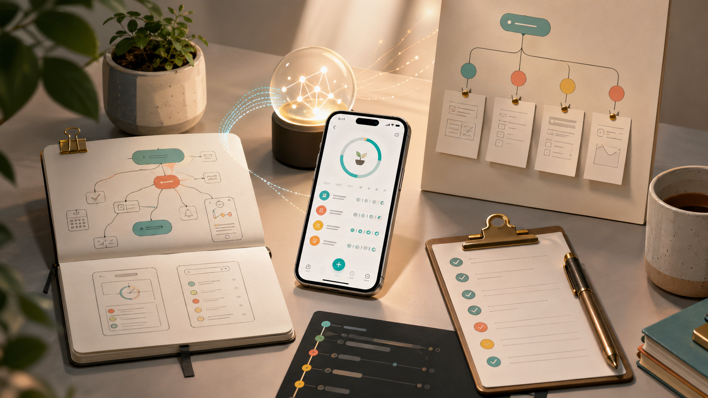
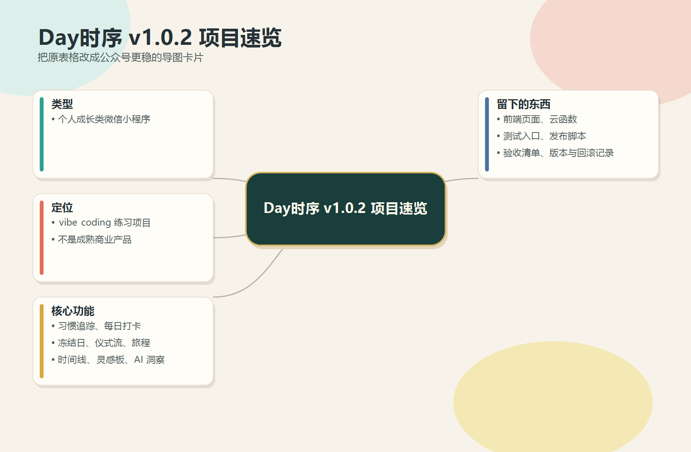
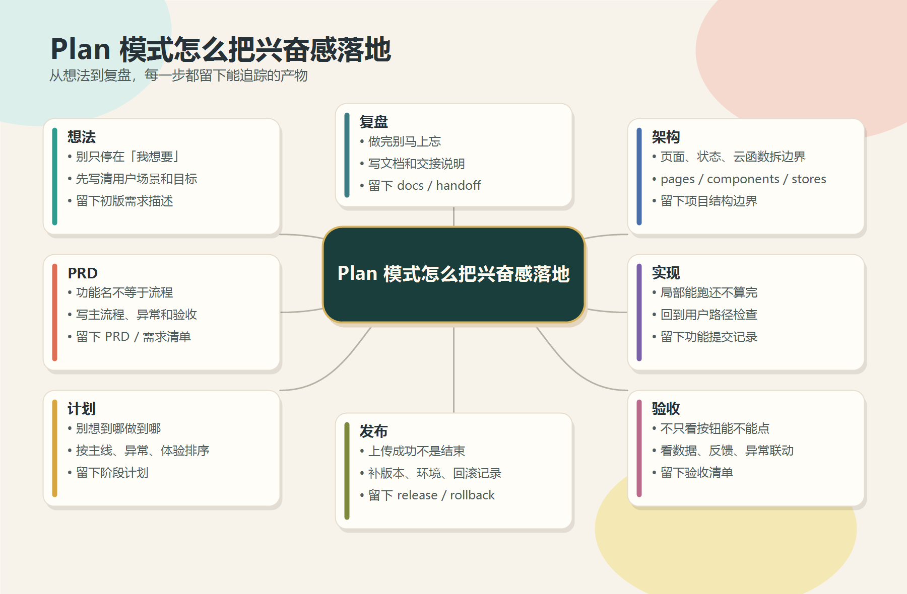
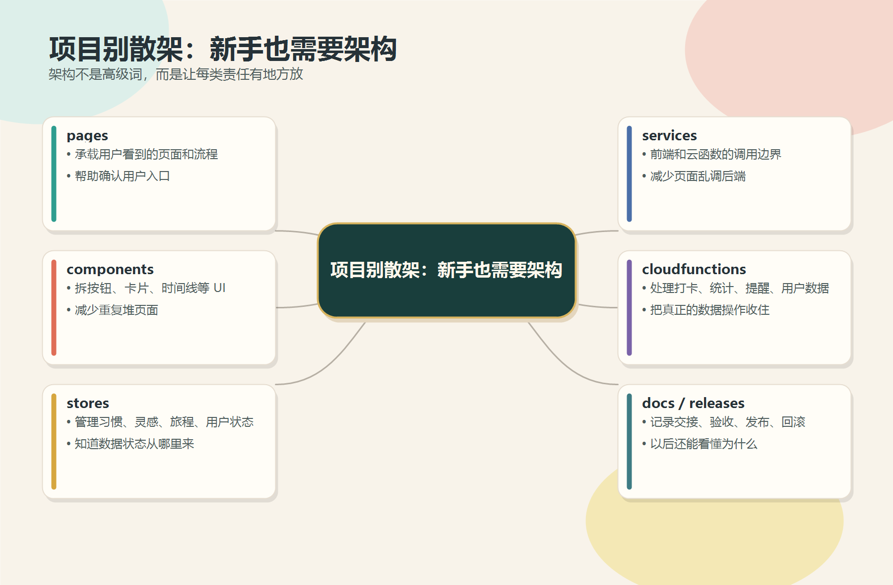
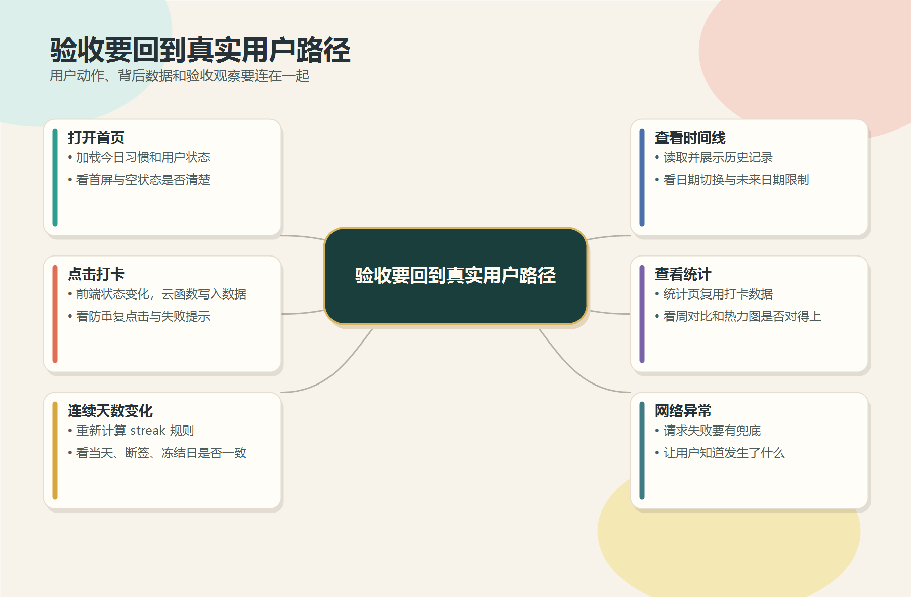
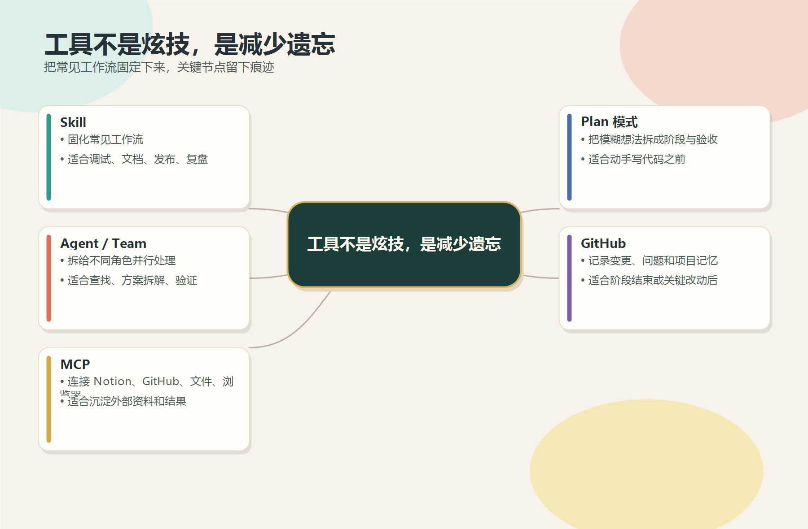
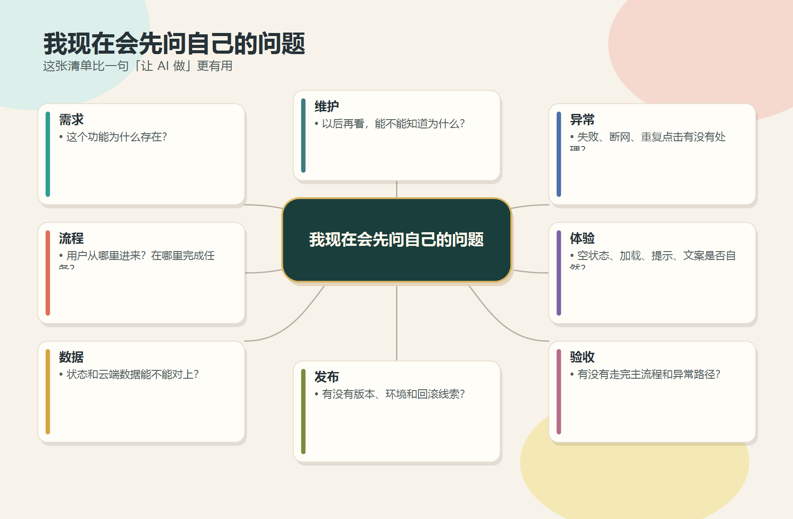
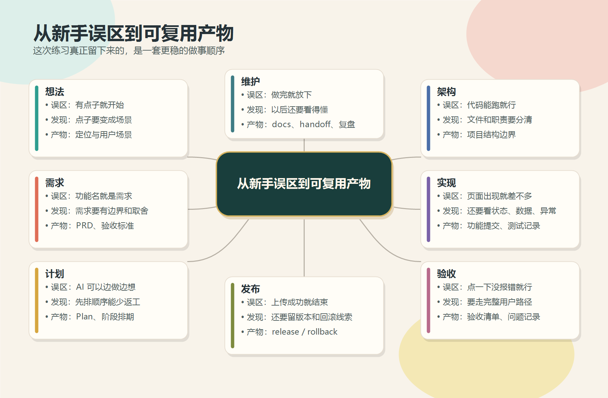

# 从一个想法到 v1.0.2：我的第一次 vibe coding 练习，以及 AI 时代的一些思考

> **导语**
>
> 我原来以为，vibe coding 的爽点是：不会代码，也能让 AI 帮我做出一个东西。
>
> 做完 Day时序 之后，这个想法变具体了。AI 的确把门打开了，但门里面不是捷径，而是一连串需要自己补上的产品、工程和表达问题。

---

## 01 从一个想法，到 v1.0.2

Day时序 最开始只是一个很普通的想法。

我想做一个偏个人成长的小程序。它可以记录习惯，完成每日打卡，推进成长旅程，也能留一个地方，放下突然冒出来的灵感。

它不是一个很大的商业项目，也不是技术上多复杂的作品。更准确地说，它是一个练习品，一个我用 vibe coding 慢慢做出来的小程序。

但对我来说，它有一个很实际的意义：这是我第一次从一个模糊想法开始，把一个东西推进到 v1.0.2。

这中间不只是让 AI 写代码。

它经历了需求整理、页面实现、云函数、数据联动、功能验收、发布上传、问题修补、版本记录，也留下了 release / rollback 这样的回退线索。

这些词放在一起，听起来像一个工程项目。

但对我来说，它更像一次心理变化。

一开始我只是想：AI 能不能帮我做出来？

后来慢慢变成：我能不能把一个想法讲清楚、拆明白、验完整，并且留下以后还能看懂的记录？

这不是一下子学会了产品开发。

只是第一次摸到了它的边。

---

## 02 需求不是一句“我要”

刚开始做的时候，我对需求的理解很浅。

我会说：我要打卡，我要时间线，我要灵感板，我要 AI 洞察。

现在回头看，这些都只是功能名。真正的需求，要继续往下问：

- 这个功能为什么存在？
- 用户会在什么时刻打开它？
- 它解决的是记录、激励、复盘，还是情绪上的需要？
- 如果用户没有按预期使用，产品要不要给他一个出口？

比如“冻结日”。

表面上，它只是一个保护连续天数的功能。但从产品角度看，它其实在回答一个更细的问题：一个习惯产品，要不要允许用户不完美？

如果产品只奖励连续不断的人，它很容易变成压力来源。可现实里，普通人就是会中断、会疲惫、会有状态不好的日子。冻结日的意义，不只是“不让数字断掉”，而是给用户一个继续回来的台阶。

这类判断，AI 可以帮我实现，但不能替我决定。

也是从这里开始，我慢慢理解 PRD 的价值。

PRD 不只是给团队看的文档。对我这种零代码基础的新手来说，它更像一张防止自己跑偏的地图：

- 核心场景是什么
- 主流程从哪里开始，到哪里结束
- 哪些状态必须覆盖
- 哪些功能可以延后
- 什么情况算完成
- 什么情况必须兜底

当这些写清楚以后，AI 反而更好用。

因为 AI 不怕任务复杂，怕的是目标飘着。

---

## 03 Plan 模式：先把路画出来

vibe coding 很容易让人上头。

一个想法刚冒出来，马上让 AI 写代码。页面很快出现，按钮很快能点，功能看起来也很快“有了”。

但项目稍微变大一点，就会开始出问题。

一个功能还没验收完，另一个想法又冒出来；一个页面刚改好，另一个状态又被影响；一天改了很多，晚上回头看，却说不清到底推进了什么。

后来我越来越依赖 Plan 模式。

不是因为它听起来专业，而是因为它能把兴奋感变成一张能执行的路线图。

这张图比一条箭头更接近我的真实感受。

我不是一开始就懂这些步骤，而是在项目推进中不断发现：原来还要补这一环，原来这里也会出问题，原来发布不是最后一步，发布之后还要能追踪、能解释、能回退。

项目排期也是这样慢慢学会的。

哪怕只是一个人做练习项目，也需要排期。不是为了制造压力，而是为了保护完成度。

先做主流程，再补异常路径，最后打磨体验。先把一个闭环跑通，再考虑加更多花样。这个顺序很朴素，但它能防止项目在中途变成一堆半成品。

---

## 04 架构不是高级词，是让项目别散架

以前我听到“架构”，会觉得那是工程师的事。

做完这个项目后，我反而觉得，新手更需要架构。

因为我不是一个能随手读懂所有代码细节的人，所以我更需要知道：页面在哪里，组件在哪里，状态在哪里，云函数在哪里，文档和发布记录又在哪里。

Day时序 后来慢慢形成了几层边界。

这个拆法没有多高级，但它很有用。

它至少让我知道，一个页面出问题时，不必把整个项目翻一遍；一个数据状态不对时，可以先看 store，再看 service，再看云函数；一个发布问题要回查时，可以先去 releases 和 docs 找记录。

架构对新手来说，不是为了显得专业。

它是为了降低恐惧感。

当项目有了边界，我才敢继续改。

---

## 05 实现不是页面出现，而是路径跑通

vibe coding 最容易给人的错觉是：页面出来了，事情就差不多了。

但页面出现，只是第一层。

真正要看的是用户路径能不能跑通。

用户打开首页，数据有没有加载？点击打卡，前端状态有没有变化？云函数有没有写入？连续天数有没有重新计算？时间线和统计页会不会同步？网络失败时，用户知不知道发生了什么？

这些问题没有那么显眼，但它们决定一个东西到底能不能用。

我以前很容易被“局部可用”骗过去。

按钮能点，弹窗能出，页面能跳，就觉得完成了。

后来才发现，真正的完成要回到完整路径里看。一个功能不是孤立存在的。它会影响状态、数据、提示、统计和后续维护。

所以验收清单很重要。

它不是形式主义，而是提醒我：别只看你刚刚改的地方，也要看用户会走到的地方。

---

## 06 测试和验收，是给未来的自己留后路

我以前对测试的理解也很浅。

总觉得测试是大项目才需要的东西。一个人做小程序，自己点一点不就行了？

后来我发现，手点当然要点，但不能只靠手点。

因为人在兴奋的时候，很容易只点自己刚改好的那条路。真正容易出问题的，往往是边角状态：

- 今天已经打过卡，再点一次会怎样
- 断签之后 streak 怎么算
- 冻结日用完之后还能不能继续保护
- 云函数失败时前端会不会假装成功
- 统计页和时间线的数据是否一致
- 发布前有没有留下版本和回滚线索

这些问题不一定每天都会遇到，但一旦遇到，就会让用户失去信任。

测试和验收的意义，就是把这些容易被忽略的地方固定下来。

它们不是为了证明我写得多好，而是为了让未来的自己少一点慌。

---

## 07 发布不是“上传成功”

第一次把小程序上传成功时，我很容易松一口气。

但后来发现，上传成功只是发布链里的一步。

更麻烦的问题在后面：

- 这次到底发布了什么
- 用的是哪个环境
- 如果出问题，怎么回退
- 哪个版本还能追溯
- 当时为什么这么改

如果这些都没有记录，发布就会变成一次性动作。出了问题，只能靠记忆找线索。

Day时序 后来补了发布脚本、版本记录、release manifest、rollback 记录和一些检查入口。

这些东西看起来没有页面那么直观，却是项目能继续维护下去的底盘。

对新手来说，发布链最重要的价值不是自动化本身，而是让每次变化都留痕。

---

## 08 工具不是炫技，是减少遗忘

做这个项目之前，我对 Skill、Agent、MCP、GitHub 这些词没有太强的感觉。

后来慢慢发现，它们真正有用的地方，不是听起来高级，而是能减少遗忘。

一个人做项目，最容易丢的不是代码，而是上下文。

今天为什么这么改，明天可能就忘了；这条问题排查到哪里，下次可能又从头来；某个功能验收过没有，过几天就说不准。

工具的意义，是把这些过程留住。

我现在更愿意把工具看成一种外部记忆。

Skill 固定工作流，Agent 帮我分角色看问题，MCP 连接 Notion 和 GitHub，Plan 模式把事情拆成可执行步骤，GitHub 把变化沉淀下来。

它们不是替我思考。

它们是在提醒我：别只顾着往前冲，也要把路标插好。

---

## 09 我现在会先问自己的问题

如果再从头做一个功能，我不会急着让 AI 开始写。

我会先问自己一组很朴素的问题。

这些问题看起来不复杂，但它们能拦住很多返工。

因为很多时候，真正的问题不是 AI 不会写，而是我自己没有想清楚。

我没有想清楚功能为什么存在，没有想清楚主流程怎么走，没有想清楚失败时怎么办，也没有想清楚发布后怎么追踪。

这时候让 AI 写得越快，返工也越快。

所以现在我会更愿意慢一点。

先把问题问清楚，再让 AI 进入执行。

---

## 10 AI 时代，真正被放大的是什么

做完 Day时序 后，我对 AI 的理解变了一点。

以前我更关注它能不能替我做事。

现在我更关注它会放大什么。

它会放大清晰的目标。你讲得越清楚，它越能往正确方向走。

它也会放大模糊的问题。你自己没想明白，它很可能给你一堆看起来完整、实际却不贴合的东西。

它会放大执行速度。一个页面、一个脚本、一个接口，过去可能要卡很久，现在可以很快生成第一版。

但它也会放大维护压力。因为生成得越快，越需要有人判断边界、验收路径、整理记录。

所以我越来越觉得，AI 不是把产品和工程问题消灭了。

它只是把问题提前摆到了我面前。

以前我可能走不到这一步，所以看不见这些问题。现在 AI 帮我跨过了第一道门槛，于是后面的功课也一起来了。

---

## 11 这次练习真正留下了什么

如果只看结果，Day时序 是一个个人成长小程序。

但如果看过程，它留下的东西其实更多。

这张图里每一格，都是我之前容易跳过的地方。

我以前会觉得，有点子就可以开始；后来发现，点子要变成场景。

我以前会觉得，功能名就是需求；后来发现，需求要有边界和取舍。

我以前会觉得，AI 可以边做边想；后来发现，先排顺序能少返工。

我以前会觉得，代码能跑就行；后来发现，文件和职责要分清。

我以前会觉得，页面出现就差不多；后来发现，还要看状态、数据和异常。

我以前会觉得，点一下没报错就行；后来发现，要走完整用户路径。

我以前会觉得，上传成功就结束；后来发现，还要留版本和回滚线索。

我以前会觉得，做完就放下；后来发现，以后还要看得懂。

这些东西，才是这次练习真正留下来的东西。

---

## 12 写在最后

如果有人问我，vibe coding 适不适合新手，我现在的答案会比以前谨慎一点。

适合。

但它适合的方式，不是让新手跳过学习，而是让新手更早碰到真实问题。

你可以更快看到页面，更快跑通流程，更快得到一个能修改的雏形。

同时，你也会更快遇到需求、边界、数据、异常、验收、发布和维护。

AI 可以帮你把第一版做出来。

但它不会替你判断什么该做，什么先不做，什么算完成，什么必须留下记录。

这次 Day时序 对我最大的意义，不是我终于做出了一个小程序。

而是我第一次知道，一个想法要变成可维护的东西，中间到底要经过多少层。

我还是新手。

但这一次，我至少不再只站在门外想象。

我已经走进去，摔过几次，也留下一点能继续往前走的路标。
